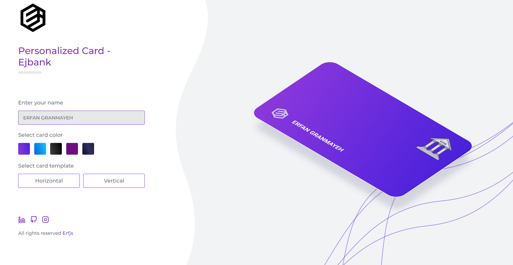

# Personalized Card | Ejbank

##### [Live Demo](https://ejbank.erfjs.com) on Netlify

## 📷 Screenshot

  

## 📋 Project description
You can personalize your bank card as you want. A very interesting program using only HTML, CSS and JavaScript, with which you can change the card name, color and model.

## 📋 شرح پروژه
شما می توانید کارت بانکی خود را به دلخواه شخصی سازی کنید. یک برنامه بسیار جالب با استفاده از HTML، CSS و جاوا اسکریپت که با آن می توانید نام، رنگ و مدل کارت را تغییر دهید.

## 💻 Technologies used
- HTML5
- CSS3/SASS
- JavaScript

